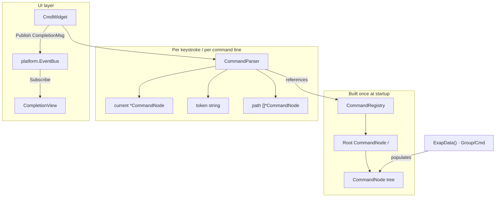
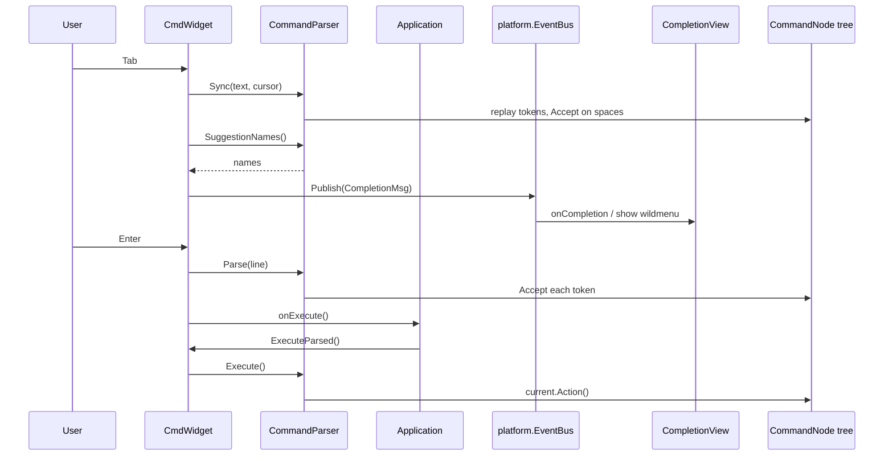

# Command System

termforge routes user actions through a **hierarchical command tree**. Colon commands (`:window left`), tab completion, and key chords (`Ctrl+W h`) all resolve against the same `CommandNode` types, but through different entry points.

**Companion docs:** [INPUT.md](INPUT.md) · [UI_ARCHITECTURE.md](UI_ARCHITECTURE.md) · [WINDOW_MANAGEMENT.md](WINDOW_MANAGEMENT.md)

---

## Table of contents

- [Ownership model](#ownership-model)
- [CommandNode — the tree](#commandnode--the-tree)
- [CommandRegistry — owns the tree](#commandregistry--owns-the-tree)
- [CommandParser — navigates the tree](#commandparser--navigates-the-tree)
- [DSL — building the tree](#dsl--building-the-tree)
- [Rest-args leaves](#rest-args-leaves)
- [CmdWidget integration](#cmdwidget-integration)
- [Tab completion via EventBus](#tab-completion-via-eventbus)
- [Key bindings](#key-bindings)
- [Adding commands](#adding-commands)

---

## Ownership model

Three types work together. Each has a distinct responsibility — do not conflate them.



| Type | Role | Owns / holds |
|------|------|----------------|
| **`CommandNode`** | One node in the hierarchy | `Name`, `Children` trie, optional `Action`, optional `RestArgs` |
| **`CommandRegistry`** | Application command catalog | `Root` node (the tree) + `Keys` trie for key chords |
| **`CommandParser`** | Runtime cursor over the tree | `current`, `token`, `path` — **does not own the tree** |

**Mental model:**

- **`CommandNode`** *is* the tree (data).
- **`CommandRegistry`** *owns* the tree (storage).
- **`CommandParser`** *navigates* the tree (state while the user types).

The tree is built once at startup (via the DSL or `Insert`). The parser resets and replays input on each Tab or Enter; it never mutates tree structure.

---

## CommandNode — the tree

Each node is either a **container** (has children, no action) or a **leaf** (has an `Action` callback).

```text
/  (root)
├── window                        ← container
│   ├── left      → Action: OnFocusLeft
│   ├── right     → Action: OnFocusRight
│   ├── up        → Action: OnFocusUp
│   └── down      → Action: OnFocusDown
├── b <name>      → Action: OnBuffer      (rest-args + completion)
├── layout <name> → Action: OnLayout      (rest-args + completion)
├── set                           ← container of application options
│   ├── equalalways   → Action: …
│   └── markcolor <name> → Action: …      (rest-args)
├── vs            → Action: SplitVertical
├── split         → Action: SplitHorizontal
├── close         → Action: ClosePane
└── quit          → Action: Quit  (:q exits app; same as Ctrl-D)

Branches above `window`, `vs`, `split`, `close` and `quit` are window-manager
commands every termforge app wants. Everything else is whatever the
application registers.
```

```go
type CommandNode struct {
    Parent   *CommandNode
    Children *collections.Trie[*CommandNode]
    Name     string
    Action   func(args ...any)
}
```

Children are stored in a **trie** (key-sequence trie reused for name lookup) so prefix completion is efficient: `Complete("win")` under root returns `[window]`.

| Node kind | `Action` | `Children` | Example |
|-----------|----------|------------|---------|
| Container | `nil` | non-empty | `window`, `set` |
| Leaf | set | may be empty | `left`, `close`, `quit` |

---

## CommandRegistry — owns the tree

```go
type CommandRegistry struct {
    Root *CommandNode
    Keys *collections.Trie[*CommandNode]  // key chord → command node
}
```

- **`Root`** — entry point for colon-command parsing (`/`).
- **`Keys`** — separate trie for keyboard bindings (`<C-w>h` → move-right). Used by `KeyBindingRegistry`, not by `CommandParser`.

The application holds one `CommandRegistry` and passes it to `NewCmdWidget` and to its key-binding setup.

---

## CommandParser — navigates the tree

The parser holds a **pointer into** the registry tree plus parse state:

```go
type CommandParser struct {
    registry *CommandRegistry
    current  *CommandNode   // position in tree (parent context for current token)
    token    string         // partial word being typed
    path     []*CommandNode // accepted nodes so far
}
```

### Parser state by example

| User input (after `:`) | `current` | `token` | `path` |
|------------------------|-----------|---------|--------|
| *(empty)* | `/` (root) | `""` | `[]` |
| `win` | `/` | `"win"` | `[]` |
| `window ` | `window` | `""` | `[window]` |
| `window l` | `window` | `"l"` | `[window]` |
| `window left` (after Enter) | `left` | `""` | `[window, left]` |

### When `current` changes

`current` moves only inside **`Accept()`**:

```go
p.current = list[0]
p.path = append(p.path, p.current)
p.token = ""
```

| Trigger | Calls `Accept()`? |
|---------|-------------------|
| **Tab** | Indirectly — `Sync()` replays finished tokens (before spaces); `Suggestions()` does not move `current` |
| **Enter** | Yes — `Parse()` accepts every token |
| **Typing** | No — text lives in `CmdWidget`; parser catches up on next Tab via `Sync()` |

`current` is the **parent context** for the token under the cursor, not the highlighted suggestion. While typing `:window l`, `current` is `window` and suggestions are `[left, right, up, down]`.

### Key methods

| Method | Purpose |
|--------|---------|
| `Sync(line, cursor)` | Replay input up to cursor; rebuild `current`, `token`, `path` |
| `Suggestions()` | `current.Complete(token)` — tab completion candidates |
| `Accept()` | Move `current` to the single matching child |
| `Parse(line)` | Reset + accept all tokens (on Enter) |
| `CanExecute()` | `current.Action != nil` |
| `Execute()` | Call `current.Action` |

---

## DSL — building the tree

The DSL in `commands/dsl.go` builds the tree declaratively instead of imperative `InsertName` calls.

| Function | Creates |
|----------|---------|
| `Cmd(name, action)` | Leaf node with `Action` (not yet in tree) |
| `CmdRest(name, action)` | Leaf with `RestArgs` — remainder of line → action args |
| `Group(name, children...)` | Container node with children attached |
| `(n *CommandNode).Group(name, children...)` | Inserts a group into `n`, returns `n` for chaining |
| `(n *CommandNode).Leaf` / `LeafRest` | Insert leaf (or rest-args leaf) into `n`, return `n` |

### Example

```go
func (a *App) buildCommandTree() {
    a.commandReg.Root.
        Group("window",
            commands.Cmd("left", a.OnFocusLeft),
            commands.Cmd("right", a.OnFocusRight),
            commands.Cmd("up", a.OnFocusUp),
            commands.Cmd("down", a.OnFocusDown),
        ).
        Group("set",
            commands.Cmd("equalalways", a.OnEqualAlways),
            commands.CmdRest("markcolor", a.OnMarkColor),
        ).
        Leaf("quit", a.OnQuit).
        Leaf("close", a.OnClosePane)
}
```

Equivalent imperative form (older style, same result):

```go
window := root.InsertName("window")
window.InsertName("left").Action = a.OnFocusLeft
// ...
```

The DSL reads as a nested outline: groups and commands mirror the logical hierarchy (`window` → `left`) instead of spelling out each parent/child link.

### DSL rules

1. **`Cmd`** — always a leaf; must be placed inside a `Group` (or root `.Group()`).
2. **`Group`** — container; may nest other `Group` calls for deeper paths (e.g. `window` → `split` → `horizontal`).
3. **Chaining** — `.Group()` on `Root` returns `Root`, so sibling groups chain at the same level.
4. **No tree mutation at runtime** — build the tree once at startup; the parser only reads the result.

---

## Rest-args leaves

Some commands need a free-form tail (shell argv, file paths). Those use **`RestArgs`**:

| DSL | Effect |
|-----|--------|
| `Cmd(name, action)` / `Leaf` | Fixed leaf; further tokens must be children |
| `CmdRest(name, action)` / `LeafRest` | Sets `CommandNode.RestArgs = true` |

After `Accept()` lands on a rest-args node, `Parse` **stops walking** and stores remaining tokens in `parser.args`. `Execute()` passes them to `Action`.

```text
:!ssh root@host
  │ └──────────┘
  │    args (not Accept()'d)
  └─ current stays on "!" → OnRun
```

A Vim-style bang is registered as `LeafRest("!", a.OnRun)`; it has an extra Parse/Sync path so `:!ls` (no space) also works.

**Dynamic completion.** `LeafRestComplete` / `CmdRestComplete` take a callback that returns candidate strings at Tab time, so completion can reflect live state (open buffers, registered layouts, discovered files) rather than a fixed list:

| Pattern | Handler | Behavior |
|---------|---------|----------|
| Fixed leaf | `Leaf("help", OnHelp)` | No arguments; further tokens would have to be children. |
| Rest args | `LeafRest("!", OnRun)` | Remainder of the line is passed through verbatim. |
| Rest args + completion | `LeafRestComplete("b", OnBuffer, bufferNames)` | Tab calls `bufferNames()` for live candidates. |

---

## CmdWidget integration

`CmdWidget` (`cmd_widget.go`) is a **muxed** cmdline: **`CmdKindCommand`** (`:`) and **`CmdKindSearch`** (`/`). It holds a `CommandParser` for Tab sync / completions on the command kind only (search has its own history and **no** Tab). **Execute** for `:` is owned by the app (`SetOnExecute` → `ExecuteParsed()`). Search Enter / live edits call `SetOnSearchSubmit` / `SetOnChange` → focused pane `SearchHost` ([INPUT.md](INPUT.md)).



Wiring, at application startup:

```go
a.cmdWidget = termforge.NewCmdWidget(a.commandReg)
a.cmdWidget.Ctx = a.ctx   // provides EventBus for CompletionMsg
a.cmdWidget.SetOnExecute(func() {
    _ = a.cmdWidget.ExecuteParsed()
})
a.completionPopup = termforge.NewCompletionPopupWidget(a.ctx)
a.AddFloatingWidget(a.completionPopup, popupRect)
```

On **Enter**, the widget calls `Parse`; if `CanExecute()`, it invokes **`onExecute`** (app controller). Leaf actions run on the `CommandNode` — no `CommandID` / `SubmitMsg` indirection for tree commands.

---

## Tab completion via EventBus

Tab completion is announced as a **`termforge.CompletionMsg`** on **`platform.EventBus`**:

```go
type CompletionMsg struct {
    Input string
    Token string
    Names []string
}
```

| Role | Where | Behavior |
|------|-------|----------|
| Publisher | `CmdWidget` (Tab) | `platform.Publish(ctx.Bus, CompletionMsg{…})` |
| Subscriber | A `CompletionView` | `CompletionPopupWidget` (floating window) or `CompletionBarWidget` (chrome row); multi-match → `ModeCompletion` |
| Keys | `ModeCompletion` | Left/Right/Up/Down cycle; Esc → `ModeCommand`; Enter applies token |

Single unique match still auto-inserts in `ModeCommand` (no mode switch). Either view is `App` chrome (drawn after `TabWidget`), not a `WidgetTree` leaf.

**Architecture note:** the wildmenu is not a popup *layer*. Whichever view is attached, it is an ordinary widget — `AddFloatingWidget` or `AddRowWidget`, mode-routed keys, draw-only-when-active — and registration order is the whole z-order. See [WINDOW_MANAGEMENT.md](WINDOW_MANAGEMENT.md#extending-chrome-no-popup-layer).

Producers depend only on the bus + message type. Consumers register independently (avoids constructor injection and cyclic wiring).

Applications use the same EventBus pattern for their own refresh notifications: declare a message type, publish it from the producer, and subscribe in the widget that must repaint.

---

## Key bindings

Key chords use the **same `CommandNode` type** but a **different registry**:

| Entry point | Registry | Lookup |
|-------------|----------|--------|
| Colon commands | `CommandRegistry.Root` | `CommandParser` walks name tokens |
| Key chords | `KeyBindingRegistry` trie | `SearchPartial(key)` per keypress |

```go
func (a *App) initKeyBindings() {
    a.keyBindings = commands.NewKeyBindingRegistry()
    a.keyBindings.Bind(
        commands.NewCommand("move-left", func(args ...any) { a.OnFocusLeft() }),
        "<C-w>l", "<C-w><Left>",
    )
    a.keyBindings.Bind(
        commands.NewCommand("jump-back", a.JumpBack),
        "<C-o>",
    )
}
```

A key binding can invoke the same handler as a colon command (`OnFocusLeft`) without sharing the parser — both are wired at init time in the application.

---

## Adding commands

### Colon command (tree)

1. Add a `Cmd` or nested `Group` where the application builds its tree.
2. Implement the handler on the application type.
3. No `CommandID` or `HandleCoreEvents` wiring needed for tree leaves — `Execute()` calls `Action` directly.

### Key chord

1. Add `a.keyBindings.Bind(…)` where the application registers bindings.

### Tab completion feedback

1. A `CompletionView` subscribes to `termforge.CompletionMsg` (the floating `CompletionPopupWidget`, or `CompletionBarWidget` for a chrome row).

---

## Package layout

| Path | Responsibility |
|------|----------------|
| `commands/command_node.go` | `CommandNode`, `CommandRegistry` |
| `commands/command_parser.go` | `CommandParser` — navigation, completion, execution |
| `commands/dsl.go` | `Cmd`, `CmdRest`, `Group`, `Leaf`, `LeafRest` builders |
| `commands/key_binding_gegistry.go` | `KeyBindingRegistry` |
| `cmd_widget.go` | `:` input, parser sync, tab; `SetOnExecute` → app |
| `completion_bar.go` | Wildmenu chrome row; `ModeCompletion` nav |
| `event.go` | `CompletionMsg` and other UI-generic events |
| `platform/event_bus.go` | Typed `Subscribe` / `Publish` |
| `logger_widget.go` | Log sink pane |

The application supplies the rest: its command tree, its key bindings, its action
methods, and the startup wiring that connects `SetOnExecute` to `ExecuteParsed`.

---

## Related documentation

- [INPUT.md](INPUT.md) — interaction modes, key routing
- [UI_ARCHITECTURE.md](UI_ARCHITECTURE.md) — widgets, event bus, app lifecycle
- [WINDOW_MANAGEMENT.md](WINDOW_MANAGEMENT.md) — chrome, splits, tabs
