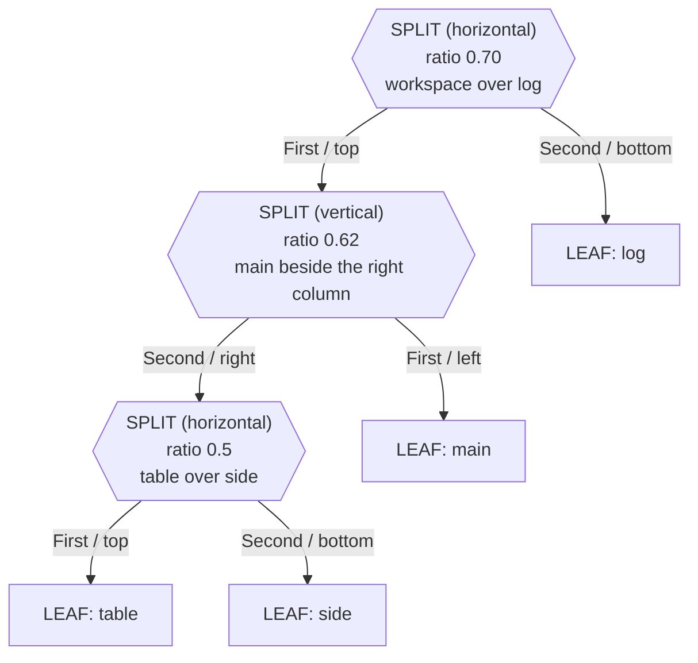

# Demo application

`cmd/demo` is a complete termforge application with no domain in it. It exists to answer
one question: *what does an app have to write, and what does the framework already do?*
Everything visible — split geometry, separator drag, wheel scrolling, text selection,
command parsing, Tab completion, key sequences — comes from termforge. The demo supplies
four panes, ten commands, and a help window.

**Companion docs:** [UI_ARCHITECTURE.md](UI_ARCHITECTURE.md) · [WINDOW_MANAGEMENT.md](WINDOW_MANAGEMENT.md) · [INPUT.md](INPUT.md) · [COMMAND_SYSTEM.md](COMMAND_SYSTEM.md)

---

## Table of contents

- [Run it](#run-it)
- [What you see](#what-you-see)
- [Commands](#commands)
- [Keys and mouse](#keys-and-mouse)
- [Source map](#source-map)
- [How it is wired](#how-it-is-wired)
- [Patterns worth copying](#patterns-worth-copying)

---

## Run it

```bash
go run ./cmd/demo
```

No flags and no configuration; `-version` prints the build version and exits. Press `?`
or type `:help` for the reference window, and `Ctrl-D` to leave.

---

## What you see

```text
┌──────────────┬──────────────┐
│              │ table        │
│ main         ├──────────────┤
│              │ side         │
├──────────────┴──────────────┤
│ log                         │
└─────────────────────────────┘
```

| Pane | Widget | Why it is there |
|------|--------|-----------------|
| `main` | `demo.ScrollPane` over `ScrollDocument` | Read-only text: scrolling, search, selection |
| `table` | `termforge.TableWidget` | Columnar list with row selection; its rows are a cheat sheet of the widgets termforge ships |
| `side` | `demo.ScrollPane` | Second text pane, so focus movement has somewhere to go |
| `log` | `termforge.LoggerWidget` | Leveled log pane fed by `ctx.Log`; warnings from `:close` and unknown `:b` names land here |

The shape is deliberately nested rather than a single row of panes:

```text
Horizontal( Vertical( main, Horizontal(table, side) ), log )
```

Hexagons are split nodes (the separators); rectangles are leaf panes.



Three split nodes, so three separators on screen, and the innermost one spans only the
right column: a split node divides the rectangle it was given, not the whole screen.

That gives drag-resize something real to act on — dragging the inner `table`/`side` bar
must not move the outer `main`/`log` one. `demo.BuildDefault` splits evenly first and
sets the ratios once the shape is final: `0.70` for the workspace band over the log,
`0.62` for `main` against the right column, `0.5` between `table` and `side`.

---

## Commands

Registered in `ExapData` with the [command DSL](COMMAND_SYSTEM.md); `:window` is a group
with four children, `:b` and `:help` are rest-arg leaves with completion callbacks.

| Command | Does |
|---------|------|
| `:window left\|right\|up\|down` | Move focus to the adjacent pane |
| `:b main\|table\|side\|log` | Focus a pane by name (Tab completes) |
| `:vs` / `:split` | Split the focused pane side by side / stacked |
| `:close` | Delete the focused pane; refuses the last one and logs a warning |
| `:only` | Collapse the tree to the focused pane |
| `:equal` | Reset every split to an even ratio |
| `:clear` | Clear the focused pane, when it implements `Clearable` |
| `:help [command]` | Open the floating window, for one command or for everything |
| `:quit` | Close the focused pane; exit once it was the last |

`:quit` follows Vim and peels off one pane at a time, while `Ctrl-D` exits immediately
however many panes are open.

---

## Keys and mouse

| Key | Action |
|-----|--------|
| `?` | Open the help window |
| `:` | Command mode |
| `Tab` | Complete a command or pane name (wildmenu bar) |
| `i` / `Esc` | Insert mode / back to normal, and close the help window |
| `Ctrl-W h/j/k/l`, `Ctrl-W <arrows>` | Move focus |
| `j` / `k` | Scroll the focused pane |
| `Ctrl-D` | Exit |

| Pointer | Action |
|---------|--------|
| Click a pane | Focus it (`WidgetTree.FocusAt`) |
| Drag a separator | Resize the two adjacent panes only |
| Wheel | Scroll the pane under the pointer, focused or not |
| Drag inside a pane | Select text; middle-click pastes (PRIMARY) |
| Double-click a status label | Copy the pane name |
| Click the command line | Focus it and place the caret at that column |

The demo's own mouse code decides only *which surface* gets the event. Focus, drag,
scroll, selection, and the status-label copy are all framework behavior reached through
`WidgetTree.FocusAt` and `TabWidget.HandleEvent`.

---

## Source map

`cmd/demo` is the application; `internal/demo` holds its panes and layout. Neither is
part of the library, and `scripts/check_imports.sh` enforces that no termforge package
imports them.

| File | Contents |
|------|----------|
| `cmd/demo/main.go` | `main`, `-version`, construct and run |
| `cmd/demo/app.go` | `DemoApp` struct — embeds `*termforge.App`, sets `App.Api = a` |
| `cmd/demo/setup.go` | `Init`: builds panes, layout, chrome, mode handlers |
| `cmd/demo/actions.go` | The command tree and every command handler |
| `cmd/demo/keybindings.go` | Normal and insert key registries, mode transitions |
| `cmd/demo/input.go` | Mouse routing, resize band math, per-mode key handlers |
| `cmd/demo/help.go` | Help text as app data, plus the `:help` pages |
| `internal/demo/scroll_pane.go` | `ScrollPane` — read-only text pane |
| `internal/demo/layout.go` | `BuildDefault` — the nested tree and its ratios |
| `internal/demo/help_overlay.go` | `HelpOverlay` — floating, scrollable window |

---

## How it is wired

`Init` registers four top-level widgets, and the `App` draws them in registration order
into one grid:

```go
a.AddWidget(a.tab)                                          // workspace: tabs + split tree
a.AddRowWidget(termforge.NewCompletionBarWidget(a.ctx), 1)  // wildmenu
a.AddRowWidget(a.cmdWidget, 1)                              // ':' command line
a.AddFloatingWidget(a.help, helpRect)                       // floating window, painted last
```

How a widget is registered is also how it is placed: the two rows take one line each at
the bottom, the workspace fills what is left (`H-2`), and the help overlay owns no layout
space at all — `helpRect` positions it per frame. Order is the whole trick behind the
floating window: added last, it paints over the workspace. Nothing recomputes rects on
resize; the App's `WidgetsList` rebuilds them from the new canvas.

`helpRect` caps the window at 78×24, keeps a margin of panes visible around it so it
reads as floating, and returns the zero `Rect` when the terminal is too small to frame a
window — the overlay's `Draw` returns early without geometry, so a tiny terminal simply
shows no window instead of crashing.

Input is split by interaction mode, each registered with `RegisterModeHandler`:

| Mode | Handler | Behavior |
|------|---------|----------|
| Normal | `handleNormalKey` | Help window first if open, then key bindings, then the focused widget's `HandleFocusKey` |
| Insert | `handleInsertKey` | `Esc` only, everything else goes to the focused widget |
| Command | `handleCommandKey` | Everything to `CmdWidget`; `Enter` deactivates and returns to normal |

---

## Patterns worth copying

**Ratios survive splits.** The demo turns `equalalways` off in both `AppState` and the
layout, so the default ratios and any separator drag persist. The cost is that `Split`
turns a leaf into a split node while leaving that node's `Ratio` at the leaf's old value
— usually `1`, which would give the new pane a one-column sliver. `equalalways` normally
hides this by rebalancing everything; `splitWith` instead evens out just the split it
created, and `:equal` rebalances on demand.

**Help lives in the app, not the framework.** `CommandNode` carries no description field,
so `help.go` keeps a `demoCommand` table of its own rather than pushing documentation
into the command tree. `:help <command>` and its Tab completion both read that table.

**A floating window is a widget, not a compositor.** `HelpOverlay` paints its frame cell
by cell rather than through `Canvas.DrawVerticalLocal`, because those helpers run border
composition and would join the window frame into the pane separators underneath. While
it is visible it takes the keyboard and the pointer, and a click outside closes it and
falls through to the pane below.

**Deleting the last pane is the caller's policy.** `WidgetTree.DeleteFocus` reports
`true` when it declined, which `:close` turns into a logged warning and `:quit` turns
into exiting the app.

---

## Related

- [UI_ARCHITECTURE.md](UI_ARCHITECTURE.md) — widgets, the frame loop, `AppApi`
- [WINDOW_MANAGEMENT.md](WINDOW_MANAGEMENT.md) — the split tree, ratios, tabs
- [INPUT.md](INPUT.md) — modes, key sequences, mouse routing
- [COMMAND_SYSTEM.md](COMMAND_SYSTEM.md) — the command DSL, parser, completion
- Source: [`cmd/demo`](https://github.com/yairgd/termforge/tree/main/cmd/demo) · [`internal/demo`](https://github.com/yairgd/termforge/tree/main/internal/demo)
