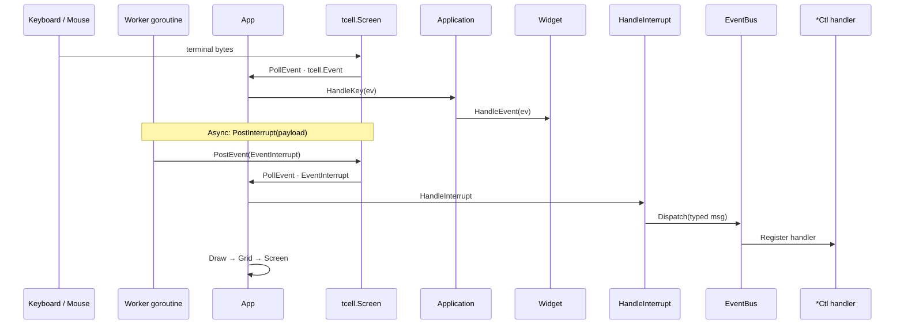
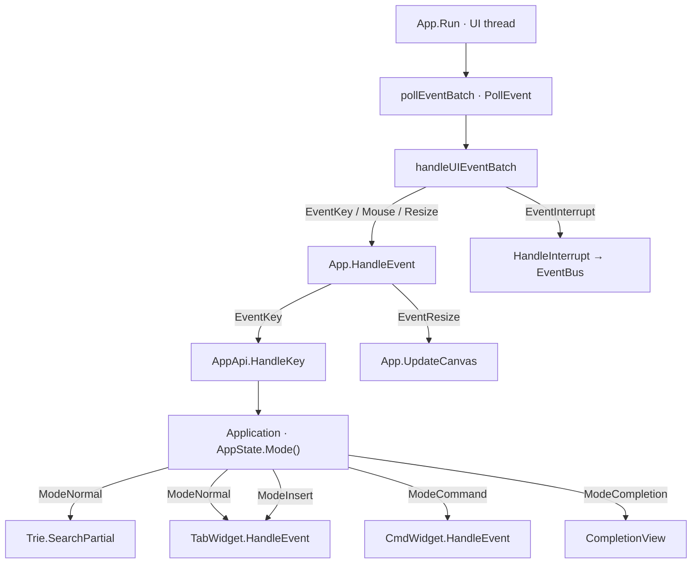
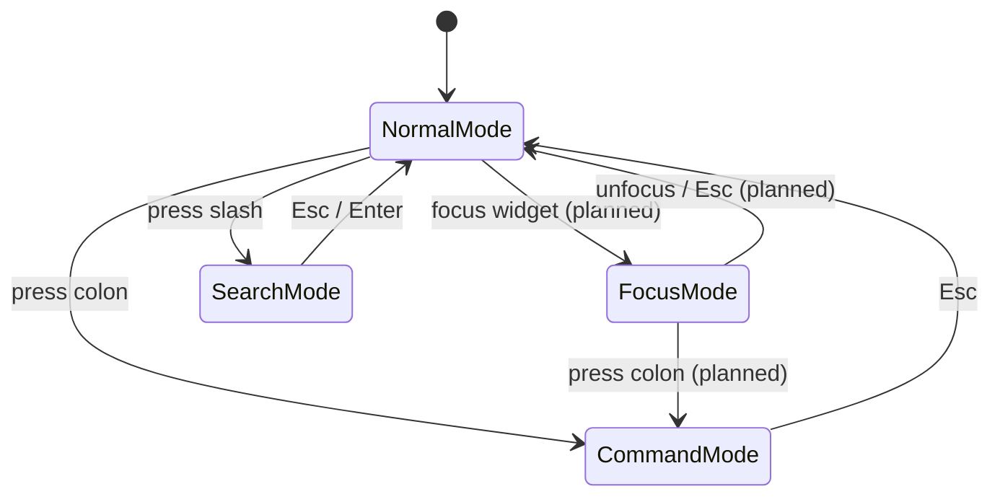
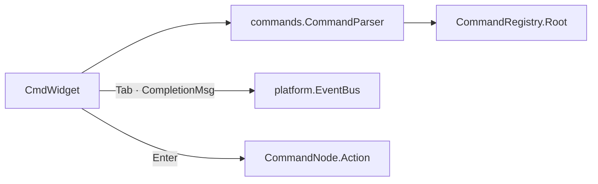

# Input Handling

termforge routes terminal input through a small number of well-defined stages: tcell
events arrive at `App`, the application decides what the current **mode** means, and
only then does a key reach a widget. This document covers event types, dispatch order,
key sequences, mouse handling, and the interaction modes.

**Companion docs:** [UI_ARCHITECTURE.md](UI_ARCHITECTURE.md) · [COMMAND_SYSTEM.md](COMMAND_SYSTEM.md) · [WINDOW_MANAGEMENT.md](WINDOW_MANAGEMENT.md)

---

## Table of contents

- [Input overview](#input-overview)
- [Keyboard handling](#keyboard-handling)
- [Key-sequence bindings](#key-sequence-bindings)
- [Mouse handling](#mouse-handling)
- [Interaction modes](#interaction-modes)
- [Vim-like command system](#vim-like-command-system)

---

## Input overview

```text
Keyboard / Mouse / async workers
        ↓
App.Run (UI thread · pollEventBatch)
        ├── PollEvent → tcell.Event
        │     ├── EventKey / EventMouse / EventResize → App.HandleEvent
        │     │       ├── EventResize → UpdateCanvas (grid + chrome rects)
        │     │       └── EventKey → AppApi.HandleKey → mode router / Trie / widgets
        │     └── EventInterrupt → HandleInterrupt → EventBus → *Ctl
        └── paint ticker (16ms) when dirty
```



**Design principles:**

1. One thread owns input and rendering (`App.Run` polls tcell directly — no background `PollEvent` goroutine).
2. Async sources post **`PostInterrupt`** → `screen.PostEvent(EventInterrupt)` — never call widget methods from reader goroutines.
3. Typed reactions live on **`*Ctl` handlers** registered on **`EventBus`**, not in a giant app `switch`.
4. **Mode-aware routing** lives in the application, not in `App`.

---

## Keyboard handling

### Event types

| tcell event | Handling |
|-------------|----------|
| `EventKey` | Primary keyboard input |
| `EventResize` | Terminal size change → reallocate canvas |
| `EventInterrupt` | Async injection (background output, redraw wakes) |
| `EventMouse` | Mouse click/scroll (enabled via `EnableMouse`) |

### Dispatch (current)

1. `App.HandleEvent` — global shortcuts (`Ctrl+D` quit, resize → `UpdateCanvas`, redraw interrupt).
   A resize needs no application hook: `UpdateCanvas` reallocates the grid and the chrome
   layout recomputes its rects (see [WINDOW_MANAGEMENT.md](WINDOW_MANAGEMENT.md)).
2. `AppApi.HandleKey` — application-level key routing by `AppState.Mode()`:
   - **Global (every mode)** — wrap the per-mode handlers so a few keys work
     regardless of mode. Job control and confirmation gates belong here, not in
     `Mode`: they are orthogonal state machines that must fire while the user is
     typing into any pane.
   - **`ModeNormal`** — `:` enters command mode, `/` enters search mode, unmatched
     keys go through the **key trie** and then to the focused widget. Bindings can
     return `Handled == false` to fall through, which is how list panes keep their
     own `Up` / `Down` while the application also binds those keys globally.
   - **`ModeInsert`** — keys go to the focused leaf widget so the user types into
     that pane. `Esc` returns to normal mode.
   - **`ModeCommand`** — all keys go to `CmdWidget` (after the global keys).
   - **`ModeSearch`** — all keys go to `CmdWidget` in search kind; live highlight on
     the focused `SearchHost`; Enter commits, Esc reverts.
   - **`ModeCompletion`** — wildmenu: arrows cycle; Esc returns to the prior mode;
     typed keys edit the source line and re-query.

`platform.Mode` is an `int`, and termforge never inspects a mode by value beyond the
ones above. An application that needs another mode declares
`const ModeX platform.Mode = platform.ModeCompletion + 1` and routes it itself.



*Source: [`diagrams/input_routing.mermaid`](diagrams/input_routing.mermaid)*

**Gap:** focus-aware routing inside the workspace is partial (`WidgetTree.focus` exists). Insert mode is wired for the focused console pane.

### Widget-level handling

Once a key reaches a widget, these termforge pieces own the editing and scrollback
behaviour. An application composes them rather than reimplementing them:

| Layer | File | Owns |
|-------|------|------|
| `InputLine` | `input_line.go` | Editing + readline history chords |
| `ConsolePane` | `console_pane.go` | Enter / Ctrl-L / PgUp / selection; walking prompt Draw |
| `CompositeTerminal` | `composite_terminal.go` | xterm emulation, key trie, PTY write via `WireTTY` |
| `Viewport` | `viewport.go` | Scroll, selection, `/search` highlight |
| `TableWidget` | `table_widget.go` | Row selection, pan, row activate on click release |

A pane built on `ConsolePane` + `InputLine` gets this for free when focused:

| Key | Action |
|-----|--------|
| `Enter` | Submit the input line through the pane's `OnSubmit` callback |
| `Backspace` / `Delete` | Edit input (`InputLine`) |
| `Left` / `Right`, `Home` / `End` | Move cursor (`Ctrl-B/F/A/E`) |
| `Up` / `Down` | Local readline-style history (`Ctrl-P/N`) |
| `Ctrl+L` | Clear scrollback (screen reset — prompt returns to top-left) |
| `Ctrl+V` | Paste **CLIPBOARD** into the input line |
| Middle-click | Paste **PRIMARY** (X11) when available, else CLIPBOARD — rising-edge only (~120ms debounce) |
| `PgUp` / `PgDn` | Scroll the output viewport |
| Rune | Insert into the input buffer |
| Mouse drag | Select scrollback text (copies to CLIPBOARD + PRIMARY) |
| Double-click | Select word under cursor and copy |
| Triple-click | Select whole line and copy |

`Ctrl+C` and `Ctrl+D` are deliberately **not** bound by the framework: what they should
do (copy, interrupt a child process, quit, answer a prompt) is application policy.
Configure the prompt strings a pane should recognise with
`CompositeTerminal.SetPromptPrefixes`; termforge ships no default prompt vocabulary.

The prompt walks down line-by-line under the scrollback while there is free space,
then pins to the bottom and scrolls once the pane is full.

Example: `CmdWidget` (`cmd_widget.go`) — uses the same `ClipboardIO` bridge as Viewport / ConsolePane:

| Key | Action |
|-----|--------|
| `Enter` | Parse command, emit `SubmitMsg` on event bus |
| `Up` / `Down` | History navigation |
| `Tab` | Complete command name |
| `Backspace` on lone `:` | Deactivate widget (app should reset mode — see gap below) |
| `Ctrl+A` / `Ctrl+E` | Move caret to start / end of editable text (after `:` or `/`) |
| `Ctrl+U` | Kill from caret to start of editable text (keeps prefix) |
| `Ctrl+V` / middle-click | Paste into the cmdline (CLIPBOARD / PRIMARY; first line only; middle-click rising-edge) |
| `Ctrl+C` / `Ctrl+X` | Copy / cut text after `:` |
| Rune / editing keys | Insert, move cursor |

Command mode entry and exit:

| Key | Handler | Action |
|-----|---------|--------|
| `:` | `HandleKey` in normal mode | `SetMode(ModeCommand)`, `CmdWidget.Activate()` |
| Click cmdline | `HandleMouse` | Same as `:` (enter command mode); sets caret from click column |
| Click outside cmdline (command mode) | `HandleMouse` | Leave command mode (like Esc), then focus the pane under the pointer |
| `Esc` | `CmdWidget` → `SubmitMsg{CmdID: CmdExitMode}` | `HandleCoreEvents` resets mode, deactivates widget |
| `Enter` | `HandleKey` after submit | `SetMode(ModeNormal)`, `CmdWidget.Deativate()` |

On Enter, `CmdWidget` resolves the first token against `AutoCompleter`, sets `CmdID` (or `termforge.CmdUnknown`), and publishes to `App.events`. **`HandleCoreEvents`** in the app dispatches by `CommandID`.

---

## Key-sequence bindings

Multi-key bindings (Vim-style `<C-w>h`, etc.) are registered on a **`commands.KeyBindingRegistry`** owned by the application.

```go
func (a *App) initKeyBindings() {
    a.keyBindings = commands.NewKeyBindingRegistry()
    a.keyBindings.Bind(
        commands.NewCommand("move-left", func(args ...any) { a.OnFocusLeft() }),
        "<C-w>l", "<C-w><Left>",
    )
}
```

In **normal mode**, key→action maps live on a **mode key trie**: `Esc`, `:`, `/`, window chords, and whatever else the application binds. Gated binds use `Handled` fallthrough so list panes keep their own `Up` / `Down`. Keys that must work in every mode are intercepted by the application's global-key wrapper rather than placed on the trie. Insert and completion modes use their own key maps the same way.

**Current bindings:**

| Sequence | Action |
|----------|--------|
| `<C-w>h`, `<C-w><Right>` | Focus right pane |
| `<C-w>l`, `<C-w><Left>` | Focus left pane |
| `<C-w>k`, `<C-w><Up>` | Focus up pane |
| `<C-w>j`, `<C-w><Down>` | Focus down pane |

Implementation: `internal/collections/trie.go` via `KeyBindingRegistry`.

**Design decision:** bindings live on the application object, not in `App`, so key chords remain app-specific while termforge provides the prefix-tree machinery.

---

## Mouse handling

`tcell` mouse support is enabled in `NewApp` (`EnableMouse` with motion events).

**Implemented today:**

| Action | Behavior |
|--------|----------|
| Click pane | Focus that pane; leave command mode if clicking outside the cmdline |
| Click cmdline | Enter command mode; set caret from column |
| Scroll wheel | Scroll focused viewport (source / console / lists) |
| Drag in viewport | Text selection; copy to CLIPBOARD and X11 PRIMARY (`platform/clipboard.go`) |
| Double-click (content) | Select word (`viewport_word.go`) and copy |
| Triple-click (content) | Select line and copy |
| Status band | Double-click name text → copy full label. Single-click / drag anywhere on the row → split resize as before (`status_sel.go`) |
| Middle-click | Paste PRIMARY (preferred) or CLIPBOARD — **rising edge only** (debounce ~120ms) |
| List-pane row click | Activate on **button release** (not every drag sample); skip same-row drag that was a text select; debounce duplicate activate ~300ms |

**Clipboard note:** selection copy writes both CLIPBOARD and PRIMARY so middle-click paste in other X11 clients sees the same text. Middle-paste inside the application prefers PRIMARY.

**Still planned:** click tab to switch; drag split gutter to resize.

**Design decision:** mouse is an **enhancement**, not the only UX. All operations must have keyboard equivalents for SSH / minimal terminals.

---

## Interaction modes



*Source: [`diagrams/input_modes.mermaid`](diagrams/input_modes.mermaid)*

| Mode | Keys go to | Purpose | Status |
|------|------------|---------|--------|
| **Normal** | Trie + focused `FocusKeyHandler` | Navigation, key sequences, workspace input | **Implemented** |
| **Insert** | Focused leaf widget | Type into the focused pane; Esc → normal | **Implemented** |
| **Command** | `CmdWidget` (`CmdKindCommand`) | `:` UI commands | **Implemented** |
| **Search** | `CmdWidget` (`CmdKindSearch`) + `SearchHost` pane | `/` live buffer search; `*`/`#` word; `n`/`N` next/prev | **Implemented** |
| **Completion** | Wildmenu + source line edit | Tab completion (`ModeCompletion`) | **Implemented** |

Mode state lives in **`platform.AppState`** on `App` (`State()`):

```go
// platform/mode.go
type Mode int
const (
    ModeNormal Mode = iota
    ModeInsert
    ModeCommand
    ModeCompletion
    ModeLua
    ModeSearch
)
```

The application registers one handler per mode at startup, wrapped so its global keys run first. Layout policy (`:set equalalways`, `:layout <name>`) reads and writes `AppState`. Focus roles — which leaf is "the main pane", which was focused last — are application state, not framework state.

**Design decision:** modes mirror Vim's normal / insert / command separation:

- Normal mode stops keystrokes reaching a pane while the user is navigating; the trie handles multi-key chords.
- Insert mode is pane-local typing.
- Command mode is for UI operations, separate from anything typed into a pane.
- Search mode muxes the same `CmdWidget` with a leading `/` (separate history, no Tab). The target is the focused pane's `SearchHost` (`viewport_search.go`); `*` / `#` search the word under the cursor and `n` / `N` jump between matches.
- Job-control keys should be mode-independent, which is why they belong in the application's global-key wrapper.

**Gaps:**

- Dedicated Focus mode (pane-local keys exclusive of global) is still planned.
- `NewTabTwoHozSplitWins` creates a horizontal split of its two widgets.

---

## Vim-like command system

The CmdLine accepts `:` prefixed commands. Press `:` to activate `CmdWidget`; type a command and press Enter.

**Full reference:** [COMMAND_SYSTEM.md](COMMAND_SYSTEM.md) — command tree ownership, DSL, `CommandParser`, tab completion.

### Architecture (current)



Flow:

1. User presses `:` → the application sets `ModeCommand` and calls `CmdWidget.Activate()`.
2. User types a partial command and presses **Tab** → parser `SuggestionNames` → `Publish(CompletionMsg)`; the `CompletionView` shows the wildmenu and the app enters `ModeCompletion`.
3. User presses **Enter** → `CommandParser.Parse` + `Execute` → leaf `Action` runs (e.g. `OnFocusLeft`).
4. The tree itself is built once at startup via the [command DSL](COMMAND_SYSTEM.md#dsl--building-the-tree).

### Legacy note

Older docs described a flat `termforge.AutoCompleter` + `CommandID` + `SubmitMsg` path for every colon command. Tree leaves now execute via `CommandParser` directly. `SubmitMsg` / `HandleCoreEvents` remain for infra events (`CmdExitMode`, layout commands not yet in the tree).

### Command categories

| Category | Examples | Dispatch |
|----------|----------|----------|
| Model / window | `:b <name>`, `:vs`, `:split`, `:close` | Window manager binds a widget to an existing model |
| Tab | `:tabnew`, `:tabclose` | `HandleCoreEvents` → tab widget (planned) |
| Application domain | whatever the app registers under its own groups | Colon tree leaves call the app's methods directly |
| UI | `:quit` / `:q` | Application decides whether to confirm before exiting |

The `:b <name>` command displays an application model, not a file. Names are declared at startup, so every model exists from initialization and there is no `:attach`.

**Design decision:** a command leaf's `Action` runs application code directly. Widgets publish events; the application decides whether to mutate layout, talk to services, or exit.

---

## Related documentation

- [UI_ARCHITECTURE.md](UI_ARCHITECTURE.md) — widgets, focus, event handling
- [COMMAND_SYSTEM.md](COMMAND_SYSTEM.md) — command tree, parser, completion
- [WINDOW_MANAGEMENT.md](WINDOW_MANAGEMENT.md) — splits, tabs, command line
