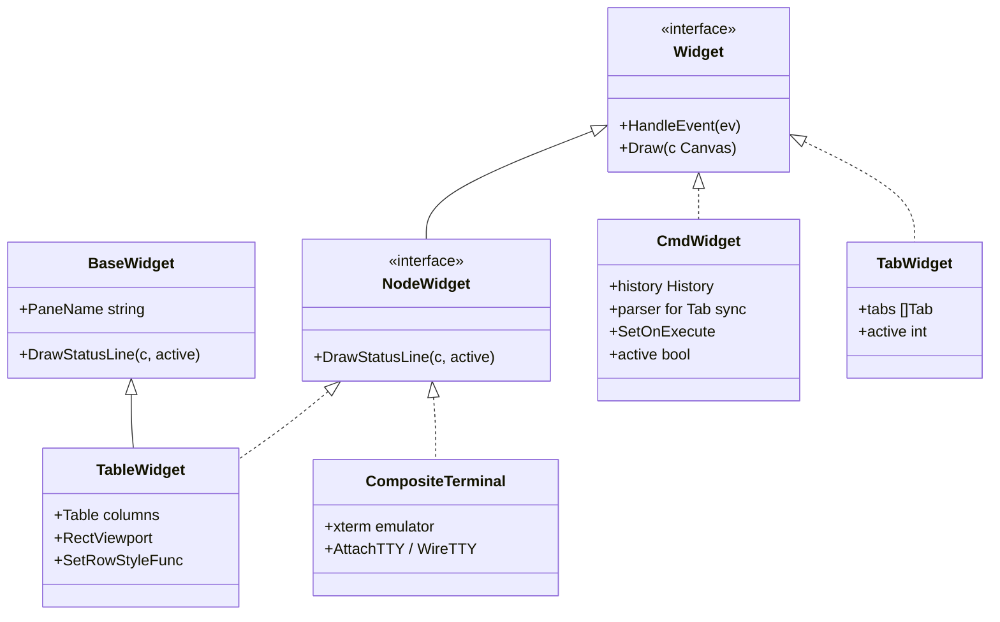
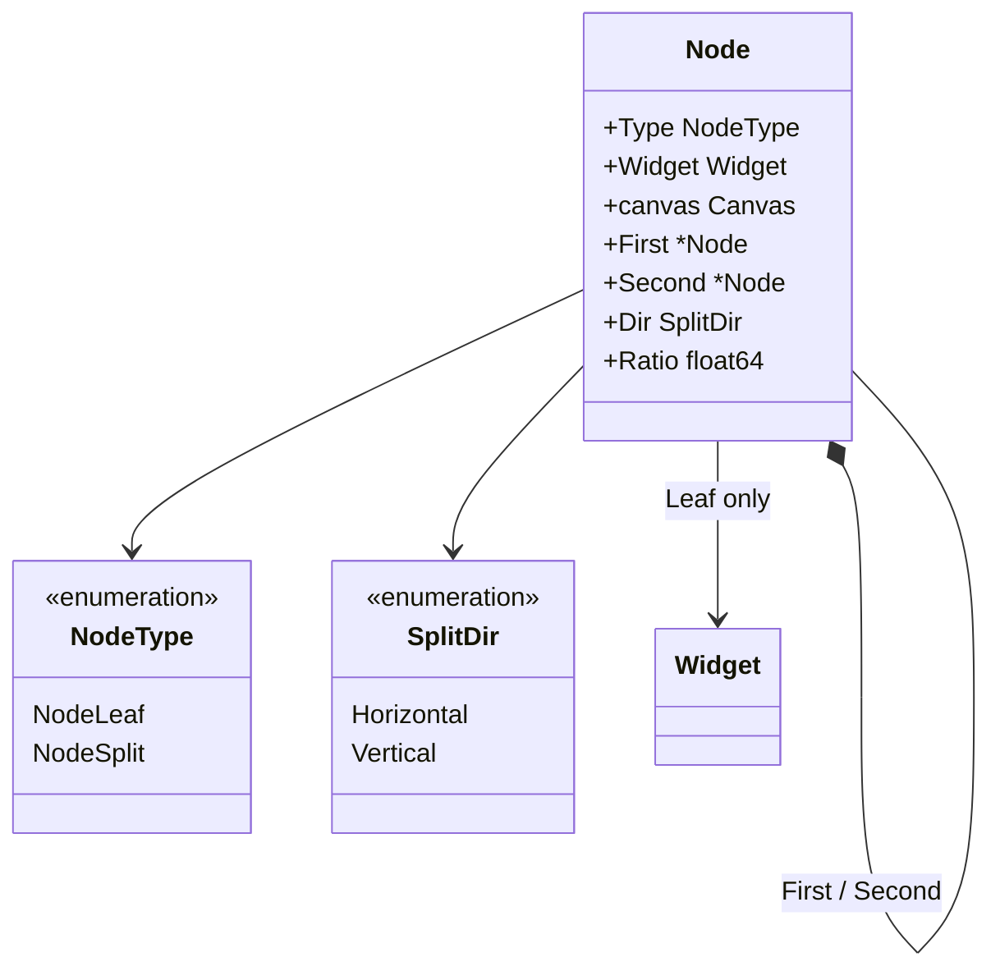
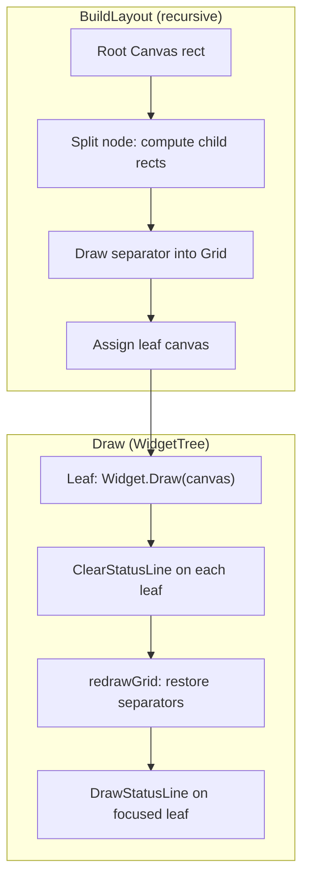
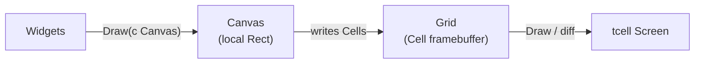
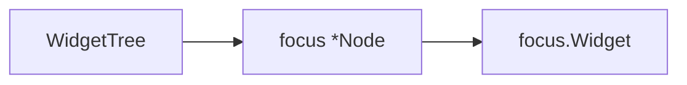
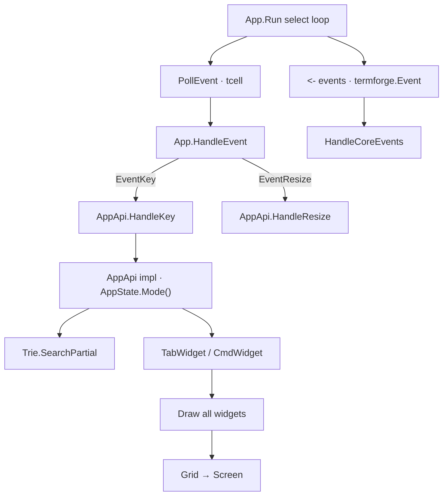
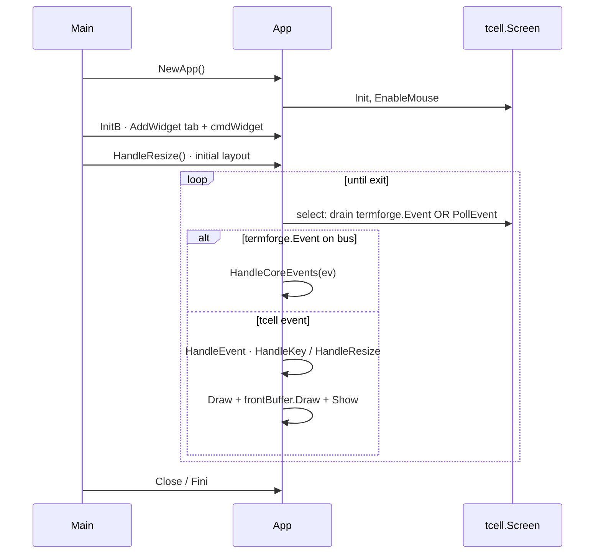

# UI Architecture

This document covers the termforge presentation layer: the widget system, split-tree layout, canvas and grid abstractions, rendering pipeline, focus management, and event handling.

**Companion docs:** [WINDOW_MANAGEMENT.md](WINDOW_MANAGEMENT.md) · [RENDERING.md](RENDERING.md) · [INPUT.md](INPUT.md) · [COMMAND_SYSTEM.md](COMMAND_SYSTEM.md)

For the same widget system carrying a real domain, see how
[gdbforge](https://yairgd.github.io/gdbforge/) — the terminal debugger termforge was
extracted from — arranges source, console, threads and breakpoints panes in its
[UI architecture document](https://yairgd.github.io/gdbforge/UI_ARCHITECTURE/).

---

## Table of contents

- [Design goals](#design-goals)
- [Widget system](#widget-system)
- [Widget tree and nodes](#widget-tree-and-nodes)
- [Layout engine](#layout-engine)
- [Canvas abstraction](#canvas-abstraction)
- [Grid abstraction](#grid-abstraction)
- [Rendering pipeline](#rendering-pipeline)
- [Focus management](#focus-management)
- [Key-sequence bindings](#key-sequence-bindings)
- [Event handling](#event-handling)
- [App lifecycle](#app-lifecycle)
- [Existing widgets](#existing-widgets)

---

## Design goals

termforge exists to answer one question: **how do application models compose, draw, and receive input in a terminal?**

Design goals:

1. **Local coordinates** — widgets never compute global screen positions.
2. **Single draw path** — Widget → Canvas → Grid → tcell.
3. **Composable layout** — binary split tree, not hard-coded pane IDs.
4. **Thin widgets** — widgets are views; domain state lives in application models.
5. **Contained backend** — tcell is confined to `Grid` and the event types. Aspiration, not yet reached: `tcell.Event` and `tcell.Style` still appear in the `Widget` interface.
6. **On-demand views** — widgets are created when the user displays a model; model lifetime is independent of widget lifetime.

---

## Widget system

Widgets are **views**. They display application models and handle local input; they do not own business logic and never communicate directly with services.

Reusable widgets (`LoggerWidget`, **`TableWidget`**, `TextWidget`) depend on **generic model interfaces** where applicable; application list panes adapt their own models through **`SetFill`**.

A widget is created only when the user asks to display a model (for example via `:buffer code` or `:split`). Multiple widgets may display the same model simultaneously. Closing a pane destroys the widget, not the model.

Everything drawable implements the `Widget` interface:

```go
type Widget interface {
    HandleEvent(ev tcell.Event)
    Draw(c Canvas)
}
```

A pane in the split tree additionally paints its own status row, which is a
separate interface so that chrome and containers — a `Layout`, an overlay, a
`CmdWidget` — are `Widget`s without carrying a status method they never use:

```go
type StatusLineDrawer interface {
    DrawStatusLine(c Canvas, active bool)
}

// NodeWidget is what a leaf of the split tree holds.
type NodeWidget interface {
    Widget
    StatusLineDrawer
}
```

`Node.Widget`, `NewWidgetTree`, `WidgetTree.Split` and `ReplaceFocusedWidget` all
take a `NodeWidget`, so a pane that forgot its status row is a compile error
rather than a blank band at the bottom of the pane.



**`BaseWidget`** (`base_widget.go`) provides shared helpers for app panes: event channels, `PaneName`, and a default `DrawStatusLine` that paints a styled bar (`▎ {name}`) when `active` is true. Embedding it is what makes a widget a `NodeWidget`; set `PaneName` in the constructor, or override `DrawStatusLine` for custom behavior. Chrome that never occupies a pane (`TabWidget`, `CmdWidget`) needs no status method at all.

**Terminal building blocks:**

| Type | Role |
|------|------|
| `CompositeTerminal` | xterm emulator + key trie; `AttachTTY` / `WireTTY` |
| `WireTTY` | PTY bytes ↔ xterm; one wiring per process-backed pane |
| `InputLine` | Single-line editor + readline history |
| `ConsolePane` | Line-based REPL — scrollback + walking prompt + `InputLine` |
| `Viewport` | Scrollable line view over a `platform.Buffer` |
| `TableWidget` | Columnar list: `RectViewport`, selection, `/search`, copy |
| `LoggerWidget` | Log pane over a `platform.Sink` |
| `CmdWidget` | Vim-style `:` / `/` command line |
| `TabWidget` | Tab container, one `WidgetTree` per tab |

**Showing a view** swaps the widget on the focused leaf — an O(1) pointer swap, with no split, no new window, and no reload. The tree never learns the concrete widget type, so an application is free to keep singleton views, create panes on demand, or mix both. Applications typically keep a registry of named views and a jump list so the outgoing view can be restored.

**Pinning a leaf** is an application policy, not a framework feature: if a particular pane must never be overwritten, the application's placement code refuses foreign widgets on that leaf.

**Host interfaces:** widgets that need to call back into the application take a host interface at construction time. termforge defines the widget; the application supplies the host.

**Why an interface, not a base struct?** Go embedding supplies defaults via `BaseWidget`, but the `Widget` interface keeps containers and prototypes independent. Not every widget embeds `BaseWidget`.

**Design decision:** widgets receive `Canvas`, not `tcell.Screen`. This prevents accidental full-screen draws and enforces layout boundaries.

**Design decision:** widgets bind to models at creation time. The window manager (`WidgetTree`, `TabWidget`) plus the application's own view dispatch own widget lifecycle; models are owned by the application and outlive any single pane.

---

## Widget tree and nodes

Inside the **Workspace**, panes are arranged as a **binary split tree**. Each node is either a **leaf** (widget) or a **split** (two children).



| Field | Leaf | Split |
|-------|------|-------|
| `Widget` | The pane content | `nil` |
| `First`, `Second` | — | Child nodes |
| `Dir` | — | `Horizontal` (top/bottom) or `Vertical` (left/right) |
| `Ratio` | — | Fraction of space for `First` (0.0–1.0) |
| `canvas` | Assigned during layout | — |

`WidgetTree` wraps the root node and tracks **focus**:

```go
type WidgetTree struct {
    root  *Node
    focus *Node
}
```

Splitting converts the focused leaf into a split node:

```go
func (w *WidgetTree) Split(dir SplitDir, newWidget Widget)
```

**Design decision:** splits always occur at the **focused** pane. This matches user expectation (split the pane I'm looking at) and avoids a separate "target pane" selection step in the common case.

Implementation: `node.go`, `widget_tree.go`.

---

## Layout engine

Layout runs in two phases each frame:

1. **`BuildLayout`** — walk the tree, divide `Rect`s, draw split borders into the `Grid`, assign child `Canvas` values.
2. **`Draw`** — four sub-phases on the workspace tree:
   - **Draw widgets** — each leaf calls `Widget.Draw(canvas)` for rows `0..H-1`.
   - **Clear status rows** — `ClearStatusLine` on every leaf (`tcell.StyleDefault`).
   - **Redraw grid** — re-run `DrawVerticalLocal` / `DrawHorizontalLocal` for all splits (restores border cells and default style after widget overwrites).
   - **Draw status lines** — every leaf calls `DrawStatusLine`; focused uses bar style, inactive overlays the name at column 4 on the grid.



**Per-pane status line:** each leaf pane has a one-row band at local `y = c.H()` (immediately below the content area). Focused panes use `PaintStatusBar` (`▎ name`); unfocused panes keep the grid and overlay a gray name at column 4 (`PaintInactiveStatusBar`). Helpers live in `status_line.go`.

### Split geometry

| Direction | First child | Second child | Gutter |
|-----------|-------------|--------------|--------|
| `Vertical` | Left (proportional via `Units()`) | Right (remainder) | 1 column separator |
| `Horizontal` | Top (proportional via `Units()`) | Bottom (remainder) | 1 row separator |

The gutter column/row is where `DrawVerticalLocal` / `DrawHorizontalLocal` write border cells into the shared `Grid`.

**Design decision:** `BuildLayout` sizes children using **`Units()`** (leaf-count weighting along the split axis). The `Ratio` field is set at split time (`0.5` default) and updated by `ComputeRatios` / `Rebalance`, but the current build path uses unit counts rather than `Ratio` directly.

Each tab owns a `WidgetTree` directly (no intermediate `Layout` type). `TabWidget.Draw` calls `BuildLayout` then `Draw` on the active tree.

Implementation: `widget_tree.go` (`buildLayout`), `tab.go`.

---

## Canvas abstraction

`Canvas` is a **drawing context** bound to a rectangular region of the shared `Grid`. Widgets draw in local coordinates; `Canvas` maps to absolute grid positions via `rect`.

```go
type Canvas struct {
    rect Rect
    grid *Grid
}
```

Key methods:

| Method | Purpose |
|--------|---------|
| `W()`, `H()` | Local width/height |
| `ScreenX/Y(local)` | Translate local → absolute grid coords |
| `ChildRect(localX, localY, w, h)` | Create sub-rect in screen space |
| `WithRect(r)` | New canvas sharing the same grid |
| `SetContent(localX, localY, ch, style)` | Draw a rune into the grid |
| `Fill(ch, style)` | Fill rect with a character and style |
| `Print` / `Printf` | Draw text into the grid |
| `DrawVerticalLocal` / `DrawHorizontalLocal` | Write border segments into Grid |
| `DrawANSIText` | PTY path: UTF-8 + SGR parse → `SetContent` (when `Viewport.ANSI`) |
| `SetContent` | Native path: one rune + `tcell.Style` (default for app-built UI) |

**Viewport** (scroll window over `platform.Buffer`) chooses the paint path via `ANSI`:

- `ANSI=false` — plain buffer + optional `RowStyle` / `CellStyle` hooks (Assembly, Code, lists).
- `ANSI=true` — buffer may contain PTY escapes; `Draw` delegates to `DrawANSIText`.

See [RENDERING.md — Viewport: two paint paths](RENDERING.md#viewport-two-paint-paths-pty-ansi-vs-native-canvas).
| `ClearLine` | Clear one local row |

**Design decision:** `Canvas` does not hold `tcell.Screen`. All widget drawing goes through the shared `Grid`; `App` owns the screen and flushes after all widgets draw. Border drawing and widget content use the same grid path.

Implementation: `canvas.go`, `rect.go`, `utf.go`.

---

## Grid abstraction

`Grid` is an off-screen **cell framebuffer**:

```go
type Grid struct {
    W, H int
    Cells     [][]Cell
    BackCells [][]Cell
}
```

Each `Cell` stores border edge flags, a composed rune, and a `tcell.Style`. See [RENDERING.md](RENDERING.md) for the cell model.

`App` maintains one screen-sized grid:

| Buffer | Purpose |
|--------|---------|
| `frontBuffer` | Shared draw target; flushed to tcell each frame |

`BackCells` records the last flushed state so `Grid.Draw` can skip unchanged cells. A separate `backBuffer` for full double-buffered compositing is planned.

Implementation: `grid.go`, `app.go`.

---

## Rendering pipeline

```text
Widgets
    ↓
Canvas        (drawing abstraction limited to a Rect)
    ↓
Grid          (off-screen framebuffer of Cells)
    ↓
tcell Screen  (final terminal backend)
```



*Source: [`diagrams/rendering_pipeline.mermaid`](diagrams/rendering_pipeline.mermaid)*

Current `App.Run` loop:

1. `select` — drain `termforge.Event` channel, or poll tcell.
2. `HandleEvent` — global shortcuts, resize, redraw interrupt; `EventKey` → `AppApi.HandleKey`.
3. `Draw(Canvas)` on each top-level widget (into shared `frontBuffer`).
4. `frontBuffer.Draw(screen)` — diff flush.
5. `screen.Show()`.

Widget `HandleEvent` is **not** called from `App` — the application's `AppApi` implementation routes keys to widgets after mode and trie processing.

---

## Focus management

Focus determines which widget receives keyboard events inside the Workspace.



Current behavior:

- `WidgetTree.HandleEvent` forwards to the focused leaf's `Widget` only.
- New tree starts with focus on the root leaf.
- `Split` moves focus to the **first** (original) child.
- The **application** calls `tab.FocusLeft/Right/Up/Down()` from trie-bound callbacks (`<C-w>h/j/k/l`).
- **Visual focus:** the focused leaf's `DrawStatusLine` paints `▎ {PaneName}` on the pane's bottom status row (see [Layout engine](#layout-engine)).

**Mode-aware routing** is implemented by the application; a typical arrangement is:

| Mode | Terminal keys routed to |
|------|-------------------------|
| `ModeNormal` | Key bindings (partial match) + `TabWidget` → focused leaf |
| `ModeInsert` | Focused leaf widget (e.g. a terminal pane) |
| `ModeCommand` | `CmdWidget` (`CmdKindCommand`) only |
| `ModeSearch` | `CmdWidget` (`CmdKindSearch`) + live highlight on focused `SearchHost` |
| `ModeCompletion` | `CompletionBarWidget` wildmenu (Esc → `ModeCommand`) |

**Planned behavior** (see [INPUT.md](INPUT.md)):

- Focus mode: all keys routed to focused widget; normal-mode navigation keys suppressed.
- Bold border highlight on the focused pane's split edges (status line provides pane-name feedback today).

**Gap:** no dedicated focus mode; tab still receives keys in normal mode after trie processing.

---

## Key-sequence bindings

`commands.KeyBindingRegistry` matches **multi-key sequences** incrementally (`SearchPartial`). The application owns its bindings:

```go
a.keyBindings.Bind(
    commands.NewCommand("move-left", func(args ...any) { a.OnFocusLeft() }),
    "<C-w>l", "<C-w><Left>",
)
```

| API | Purpose |
|-----|---------|
| `Bind(cmd, seqs...)` | Register key sequence(s) → `CommandNode` |
| `SearchPartial(key)` | Feed one key; return command on exact match |

Sequences use angle-bracket tokens (`<C-w>`, `<Up>`, …) from `platform` key parsing.

**Design decision:** binding state is per-application, not global — multiple apps or tests can bind independently.

Implementation: `collections/trie.go` via `commands.KeyBindingRegistry`. The application wires bindings and normal-mode dispatch.

---

## Event handling

termforge separates **terminal events** from **domain events**.

| Plane | Type | Handler |
|-------|------|---------|
| Terminal | `tcell.Event` | `App.HandleEvent` → `AppApi.HandleKey` / `HandleResize` |
| Domain | `termforge.Event` | **`AppApi.HandleCoreEvents`** — single application dispatch hub |

### Terminal dispatch (current)



*Source: [`diagrams/input_routing.mermaid`](diagrams/input_routing.mermaid)*

The main loop uses `select` with a `default` branch: drain pending `termforge.Event` messages first, otherwise poll tcell. This keeps domain dispatch responsive without blocking keyboard input.

Global keys handled by `App`:

| Key / event | Action |
|-------------|--------|
| `Ctrl+D` | Exit application |
| `EventResize` | `UpdateCanvas()`; `AppApi.HandleResize()` sets widget rects |
| `EventInterrupt` | Redraw request (`termforge-redraw`) |

Application keys handled by the `AppApi` implementation (`HandleKey`). A Vim-style application typically binds:

| Key / context | Action |
|---------------|--------|
| `:` (normal mode) | Enter command mode, activate `CmdWidget` |
| `/` (normal mode) | Enter search mode (`ActivateSearch`); target = focused pane |
| `*` / `#` (normal mode) | Search word under cursor forward / back |
| `n` / `N` (normal mode) | Search next / previous in the focused pane |
| `<C-w>…` (normal mode) | Focus movement / `:only` via trie |
| Other keys (normal mode) | Trie partial match, then `TabWidget.HandleEvent` |
| All keys (command / search mode) | `CmdWidget.HandleEvent` |

### Domain event bus

Any subsystem can publish to `App.events` (`Events() chan termforge.Event`). The bus is **not** broadcast to widgets — every event is delivered to the application:

```go
type AppApi interface {
    HandleCoreEvents(ev Event)          // all domain events land here
    HandleKey(ev *tcell.EventKey)       // mode routing, trie, widget dispatch
    HandleResize()                      // assign top-level widget rects
}
```

**Current producers:**

| Producer | Event | Example |
|----------|-------|---------|
| `CmdWidget` | `SubmitMsg` | User pressed Enter on `:quit` |
| Application services | own message types | Background producers publish onto the same bus |
| Other widgets | TBD | Publish via shared channel or an injected emitter |

**Example flow (`CmdWidget` → app):**

1. User types `:quit`, presses Enter.
2. `CmdWidget` `Parse`s the line on the command tree.
3. `onExecute` → app `ExecuteParsed()` → leaf `Action` (e.g. quit).

See [COMMAND_SYSTEM.md](COMMAND_SYSTEM.md#cmdwidget-integration).

### Async terminal events

Background producers use `tcell.NewEventInterrupt` to inject messages into the main loop. This avoids locking the screen from reader threads — a common tcell pattern.

**Current:** structured application messages travel on the domain bus; raw pane bytes use **`WireTTY`** → `CompositeTerminal`.

**Design decision:** prefer `EventInterrupt` for tcell wakeups today; domain bus for application-level reactions.

---

## App lifecycle



`AppApi` is implemented by the application:

- `HandleKey` — mode routing, trie dispatch, widget `HandleEvent`.
- `HandleResize` — top-level widget rects after `UpdateCanvas`.
- `HandleCoreEvents` — **all** domain events from the bus.

`AppAPI` in `app_api.go` (`Publish`, `RequestRedraw`, …) is a separate planned surface for widgets; not yet wired everywhere.

---

## Existing widgets

These ship with termforge. Application panes are built by embedding them or `BaseWidget`.

| Widget | File | Role |
|--------|------|--------|
| `Viewport` | `viewport.go` | Scrollable line view over `platform.Buffer`; native and ANSI paint paths |
| `TableWidget` | `table_widget.go` | Columnar list: `RectViewport`, `CellBuffer`, selection, `/search`, copy |
| `CompositeTerminal` | `composite_terminal.go` | xterm emulator + key trie + `WireTTY` attach |
| `ConsolePane` | `console_pane.go` | Line-based REPL shell (scrollback + walking prompt + `InputLine`) |
| `InputLine` | `input_line.go` | Shared readline editor + history |
| `LoggerWidget` | `logger_widget.go` | Log pane — `platform.Sink`, scroll/clear, shared Viewport clipboard |
| `CmdWidget` | `cmd_widget.go` | Vim-style `:` / `/` cmdline mux (`CmdKindCommand` / `CmdKindSearch`), Tab completion, execute / search callbacks |
| `TabWidget` | `tab.go` | Tab container forwarding to a per-tab `WidgetTree` |
| `BaseWidget` | `base_widget.go` | Shared pane helpers: `PaneName`, event channel, default status line |

Widget hierarchy target:

*Source: [`diagrams/widget_hierarchy.mermaid`](diagrams/widget_hierarchy.mermaid)*

---

## Related documentation

- [WINDOW_MANAGEMENT.md](WINDOW_MANAGEMENT.md) — splits, tabs, workspace
- [RENDERING.md](RENDERING.md) — cells, borders, Unicode
- [INPUT.md](INPUT.md) — modes and key routing
- [COMMAND_SYSTEM.md](COMMAND_SYSTEM.md) — command tree, parser, completion
