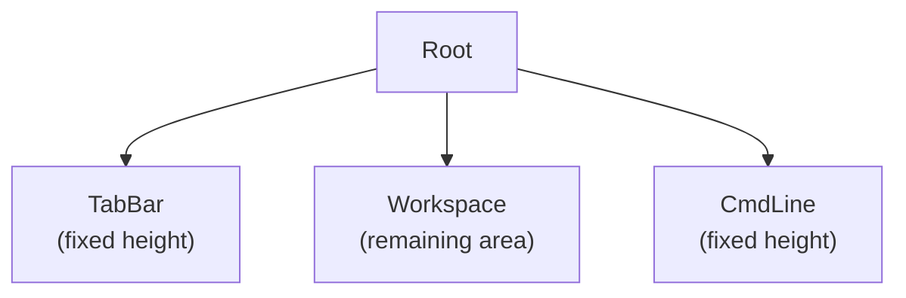
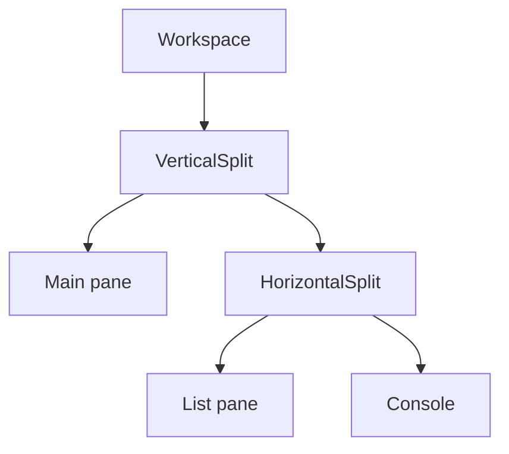
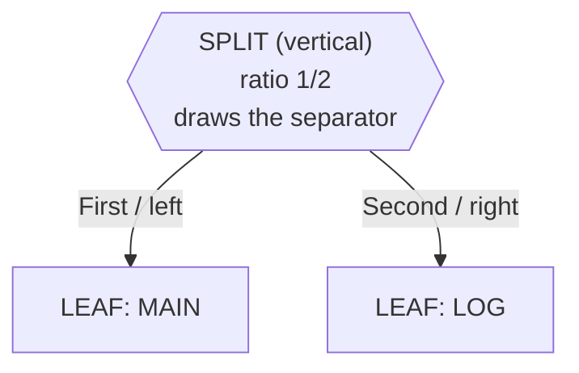
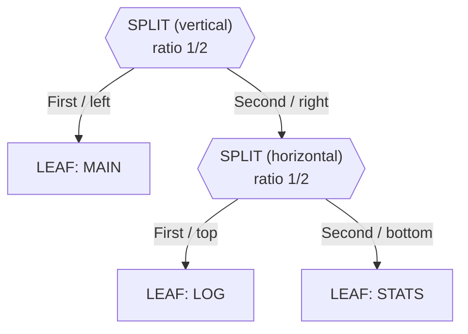
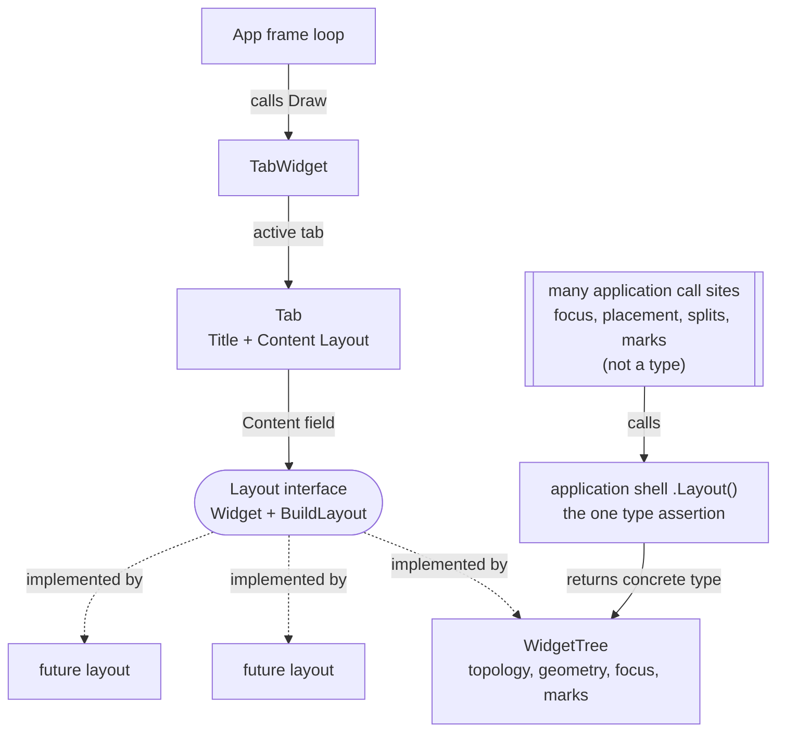
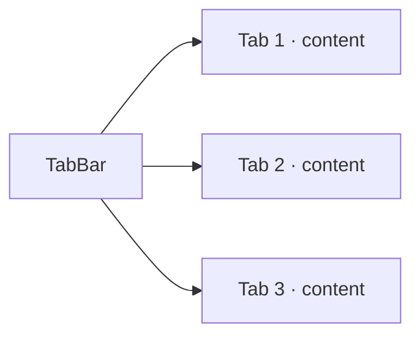

# Window Management

termforge organizes panes through a **Workspace** containing a recursive **split tree**, managed at the top level by **tabs** and a global **command line**. Each workspace pane shows a **per-pane status line** at its bottom edge when focused.

**Companion docs:** [UI_ARCHITECTURE.md](UI_ARCHITECTURE.md) · [INPUT.md](INPUT.md) · [RENDERING.md](RENDERING.md)

---

## Table of contents

- [Top-level layout](#top-level-layout)
- [Workspace concept](#workspace-concept)
- [Split tree architecture](#split-tree-architecture)
- [Horizontal and vertical splits](#horizontal-and-vertical-splits)
- [Splitting at runtime](#splitting-at-runtime)
- [Tab is a generic Layout container](#tab-is-a-generic-layout-container)
- [Tab management](#tab-management)
- [Command line](#command-line)
- [Per-pane status line](#per-pane-status-line)
- [Global application state](#global-application-state)
- [Planned window operations](#planned-window-operations)

---

## Top-level layout

The root UI is **not** a split tree. It is a fixed vertical stack:

```text
Root
├── TabBar      (fixed height)
├── Workspace   (remaining area — contains split tree)
└── CmdLine     (fixed height)
```

```text
+--------------------------------------------------+
| Tab1 | Tab2 | Tab3                               |
+--------------------------------------------------+
|                                                  |
|                 Workspace                        |
|                                                  |
+--------------------------------------------------+
| : command line                                   |
+--------------------------------------------------+
```



*Source: [`diagrams/top_level_ui.mermaid`](diagrams/top_level_ui.mermaid)*

**Design decision:** keeping TabBar and CmdLine **outside** the split tree means:

- Tabs always remain visible regardless of pane layout.
- The command line is a stable anchor (like Vim's `:` line).
- Workspace resize math is isolated — only the middle band changes height on terminal resize.
- Optional chrome overlays (wildmenu, future search/message bars) share the same App layer — **no popup compositor**.

**App chrome** is a `WidgetsList` — the flat `Layout` at App level, the counterpart of `WidgetTree` inside the workspace. Apps declare the banding once at setup time and never compute rects on resize:

```go
a.AddWidget(a.tab)                                   // TabWidget: fills what the rows leave
a.AddRowWidget(completionBar, 1)                     // CompletionBarWidget (overlay row)
a.AddRowWidget(a.cmdWidget, 1)                       // CmdWidget (: line)
a.AddFloatingWidget(a.help, helpRect)                // rect recomputed per frame
```

`WidgetsList.BuildLayout` stacks the rows top to bottom in registration order and gives the fill widget everything left over, so the example above yields the same bands as before: workspace `H-2`, bar at row `H-2`, cmdline at row `H-1`. `TabWidget.Draw` uses its full assigned rect. `App.Draw` paints in registration order, so the completion bar can overwrite row `H-2` after the tab. The bar’s `Draw` is a no-op unless wildmenu is active — otherwise the pane status line stays visible.

Geometry is rebuilt on every frame and on every `UpdateCanvas`, so a resize needs no application hook at all — `AppApi` has none. `App.WidgetRect(w)` returns the rect a widget was given, for mouse routing.

### Extending chrome (no popup layer)

Reuse the same pattern for future overlays (search bar, confirm strip, message line):

1. Register a chrome widget at App level (same event/draw layer as tab + cmdline).
2. Pick its placement there: `AddRowWidget` for a band, `AddFloatingWidget` for a window.
3. Own keys with a `platform.Mode` (like `ModeCompletion`) or forward when `Active()`.
4. `Draw` only when needed so idle overlays do not cover status lines.

Do **not** introduce a separate popup/z-order system for one-line chrome.

---

## Workspace concept

The **Workspace** is the rectangular region between TabBar and CmdLine. It is the **only** place where recursive splits exist. Applications commonly add their own shell type above the layout to own pane policy (which pane may host which view, placement rules, marks); termforge deliberately has no opinion there.

Workspace panes are **widgets** — views bound to application **models** owned by the application's controllers. A typical mapping:

| Model | Widget (view) | Purpose |
|-------|---------------|---------|
| Text buffer (per document) | `Viewport` pane | Scrollable text, gutters, row markers |
| Row/column collection | `TableWidget` pane | Sortable, selectable list |
| Child process on a PTY | `CompositeTerminal` pane | Live process output + input |
| Line-based REPL | `ConsolePane` | Scrollback + walking prompt |
| Logger sink | `LoggerWidget` | Application log |

```text
Application (composition root)
├── domain services          →  own models
├── controllers              →  model lifetime, not pane lifetime
├── view registry            →  widgets created on demand
└── Workspace                →  TabWidget (geometry + focus)
```

Each pane is a **leaf widget** in the split tree. The Workspace band does not draw content itself — it delegates geometry to `WidgetTree.BuildLayout`. Models exist whether or not a widget is currently displaying them.

---

## Split tree architecture

The split tree is a **full binary tree** where internal nodes are splits and leaves are widgets.



*Source: [`diagrams/split_tree.mermaid`](diagrams/split_tree.mermaid)*

Example ASCII layout matching the diagram above:

```text
Workspace
└── VerticalSplit
    ├── Main pane
    └── HorizontalSplit
        ├── List pane
        └── Console
```

### Node types

```text
Node
├── Leaf (Widget)
└── Split
    ├── Horizontal  (top / bottom)
    └── Vertical    (left / right)
```

**Design decision:** binary splits (not n-way splits) simplify ratio math and border drawing. An n-way toolbar layout can be built by composing binary nodes — the same approach used by Emacs window management and many IDE dock systems.

### A separator *is* a node

The most important property of this tree, and the easiest one to miss: **it is not a tree of panes.** Internal nodes and leaves mean two completely different things.

> **Every visible separator on screen originates from an internal split node.
> Every actual pane/widget is a leaf node.**

| Node kind | Marked as | What it is | Holds a widget? |
|-----------|-----------|------------|-----------------|
| **Split** | `\|` vertical — divides into **left / right**<br>`-` horizontal — divides into **top / bottom** | the division itself, i.e. the separator line you see | No — `Split` sets `node.Widget = nil` |
| **Leaf** | the widget name (`MAIN`, `LOG`, `LIST`, …) | one pane | Yes |

A split node owns a direction, a `Ratio`, and two children. It takes the rectangle handed to it, keeps **1 cell for the separator it draws**, and gives what remains to `First` and `Second`. So counting the split nodes in a tree tells you exactly how many separator lines appear on screen.

The two cases below build this up: one separator, then a nested separator. For a
six-pane tree built from five splits, see how gdbforge composes its
[shipped `default` layout](https://yairgd.github.io/gdbforge/WINDOW_MANAGEMENT/#the-shipped-default-layout).

#### Case 1 — simple split

One split node, two leaves. The split node *is* the vertical line between the panes.

```text
TREE                                   SCREEN

        |   <- SPLIT NODE              +----------+----------+
       / \     (vertical separator)    |          |          |
      /   \                            |   MAIN   |   LOG    |
  MAIN     LOG         ==>             |          |          |
    ^       ^                          +----------+----------+
  LEAF    LEAF                                    ^
                                         this separator *is*
                                         the "|" split node
```

Hexagons are split nodes (the separators); rectangles are leaf panes.



#### Case 2 — nested split

Replacing a leaf with a split node is what creates nesting. Here the root's `Second` child is no longer a pane but another separator, so the right half of the screen gets divided again — this time top/bottom.

```text
              |  <- SPLIT NODE / separator  (vertical: left / right)
             / \
            /   \
        MAIN     -  <- SPLIT NODE / separator  (horizontal: top / bottom)
                / \
              LOG  STATS
               ^     ^
             LEAF   LEAF
```

```text
TREE                         SCREEN

       |                    +---------+--------+
      / \                   |         |  LOG   |
   MAIN   -       ==>       |  MAIN   |--------|  <- the "-" split node
         / \                |         | STATS  |
       LOG STATS            +---------+--------+
                                      ^
                              the "|" split node
```

Two split nodes, so two separators. Note the `-` separator spans only the right column: a split node divides *the rectangle it was given*, not the whole screen.



---

## Horizontal and vertical splits

| `SplitDir` | Orientation | First child position | Separator |
|------------|-------------|----------------------|-----------|
| `Vertical` | Left \| Right | Left | Vertical line (`│`) |
| `Horizontal` | Top / Bottom | Top | Horizontal line (`─`) |

Layout algorithm (`widget_tree.go`):

1. Compute first-child size from the split node's **`Ratio`**, clamped to `minPaneCells`.
2. Reserve 1 cell for the separator.
3. Assign remaining space to second child.
4. Recurse into both children with child `Canvas` values (`WithRect`).

**Ratio is input only.** `BuildLayout` reads `Ratio` (in `verticalSplitRects` / `horizontalSplitRects`) and never writes it back, so geometry is a pure function of the ratios and the canvas: resizing the console scales panes and a shrink-then-grow restores them exactly. `Ratio` changes only on `Split` / `DeleteFocus` (via `Units()`-weighted `ComputeRatios`, when `equalalways` is on), on a separator drag, and when a named layout is applied.

**Border drawing:** separators are written into the shared `Grid` during `BuildLayout`, not by individual widgets. This ensures corners align when splits nest.

---

## Splitting at runtime

```go
tree := NewWidgetTree(initialWidget)
tree.Split(Vertical, newWidget)  // splits focused pane
```

What happens:

1. The focused leaf becomes a split node.
2. `First` retains the original widget; `Second` gets the new widget.
3. Focus moves to `First` (original pane).
4. `Ratio` is set to `0.5`.

**Design rationale:** splitting at focus matches Vim and Emacs user expectations. Alternative designs (split always right, pick target pane first) may be added as commands later.

`NewTabTwoHozSplitWins` builds a tree with an initial horizontal split of two widgets. Applications define **named layouts** — builder functions that assemble a whole tree — and apply them with a command such as `:layout <name>`:

A builder returns a `*WidgetTree`; the application mounts it with `TabWidget.SetLayout` and then re-applies any startup wiring (status clipboard, resize hook, `equalalways`, leaf marks) that a freshly built tree does not carry.

Register layout names through `AppState.RegisterLayout` so completion and `:layout` validation see them. Per-layout key policy is application state, not something `Tab` tracks.

---

## Tab is a generic Layout container

A `Tab` hosts any **`termforge.Layout`** — the split tree today, and any future layout (a form, a text viewer, a different window arrangement, a whole embedded app):

```go
type Layout interface {
    Widget // HandleEvent, Draw
    BuildLayout(c Canvas)
}
```

A `Layout` draws no status line of its own — in the tiling tree each pane paints its own status row — which is why `Widget` carries only `HandleEvent` and `Draw`, and `DrawStatusLine` lives on the separate `NodeWidget` interface that leaves implement.

Two consumers reach the same `WidgetTree`, by two deliberately separate routes:

- **Rendering and lifecycle — the top path.** `App → TabWidget → Tab → Layout interface → WidgetTree`. Everything on this path is generic: `TabWidget` and `Tab` see only the interface methods above, so neither can acquire a dependency on split-tree behaviour and a tab can host a completely different `Layout` with no changes.
- **Application logic — the left path.** Code that genuinely needs split-specific operations (focus navigation, pane placement, splitting, leaf marks) takes the concrete `*WidgetTree` from the application's own accessor. Those operations are intentionally absent from the interface.

Splitting the routes this way is what let the 28 forwarding methods `Tab` used to carry disappear: application code no longer hops through the container to reach the tree, while `Tab` stays small enough to host a future layout that has no panes at all. The application's accessor is the single place the interface is narrowed to a concrete type.



Solid arrows are runtime use (a call, a field); dotted arrows are the `implements` relationship. Every box is a Go type except the double-barred one, whose shape marks it as a set of scattered call sites — `lay := a.Layout()` appears in about a dozen files such as `workspace_policy.go`, `workspace_place.go` and `actions.go`.

*Source: [`diagrams/tab_layout.mermaid`](diagrams/tab_layout.mermaid)*

**`WidgetTree` is the tiling implementation** and is handed to the tab as its content directly. There is no wrapper type between the interface and the tree, so every pane, focus and mark operation is reachable on the layout with no forwarding code:

```go
lay := app.Layout() // *termforge.WidgetTree
lay.FocusLeft()
lay.Split(termforge.Vertical, pane)
lay.SetLeafMark("code", leaf)
```

**Do not add `Tab` or `TabWidget` methods that forward into a `Layout`.** Code needing arrangement-specific behaviour takes the layout and drives it directly. The accessor returns nil when the tab hosts a non-split layout, which is the signal that mark and slot APIs do not apply.

A layout can also sit **inside a leaf**, giving two independent trees in one tab — it must implement `StatusLineDrawer` as well, since a leaf holds a `NodeWidget`. `WidgetTree.buildLayout` hands a nested layout its canvas. Focus arbitration between two trees is separate policy and is not implemented.

## Tab management

**Tab** is chrome: a title plus a `Layout`. For the tiling layout, focus and named leaf marks live on the **`WidgetTree`** itself. Mark **names** and focus policy are **application-private**; termforge stays free of application roles so unrelated apps can reuse it.



Current `TabWidget` implementation:

```go
type Tab struct {
    Title   string
    Content Layout
}

type TabWidget struct {
    tabs   []Tab
    active int
}
```

Its whole surface is `Layout()`, `SetLayout()`, `Draw`, `HandleEvent` and the two constructors.

| Feature | Status |
|---------|--------|
| Single tab container | Implemented |
| Hand events/draw to active tab's Layout | Implemented |
| Named leaf marks on WidgetTree | Implemented |
| Generic non-tree tab content | Implemented (`Layout` interface); no second implementation yet |
| Nested layout inside a leaf | Structurally supported; focus arbitration not implemented |
| Tab header rendering | Not implemented |
| Tab switching | Not implemented |
| Tab close / new tab | Not implemented |
| Persist layout per tab | Not implemented |

**Design decision:** a tab is a **workspace preset**, not a separate session. One tab might hold "document + console" while another holds "charts + log". Binding a distinct session per tab is left to the application.

---

## Command line

The **CmdLine** is a top-level band for **Vim-style `:` commands**, distinct from any prompt belonging to a process running inside a console pane.

```text
+--------------------------------------------------+
| : break main                                     |
+--------------------------------------------------+
```

`CmdWidget` (`cmd_widget.go`) provides:

- Vim-style `:` activation and drawing on the bottom line (row `H-1` of the terminal).
- Command history (`termforge.History`) — Up/Down navigation.
- Tab completion (`termforge.AutoCompleter`) — command name only.
- **`SubmitMsg` on the event bus** — resolved `CommandID` + args; app dispatches in `HandleCoreEvents`.

Command mode is entered by the **application** (`:` → `ModeCommand`, `CmdWidget.Activate()`), not by `CmdWidget` alone. `Esc` returns to normal mode at the app layer.

**Current state:** `:quit` / `:q` exits the debug session (same as Ctrl-D). `:close` removes the focused pane/split. Split commands (`:vs`, `:split`) partially wired. Unknown commands emit `termforge.CmdUnknown`.

**Design decision:** keep the CmdLine separate from any in-pane console because:

- A console pane speaks whatever dialect its child process speaks; the CmdLine speaks **UI commands** (`:split`, `:focus`, `:close`, `:quit`).
- Users can run UI operations without sending spurious input to the child process.
- The two have different completion vocabularies.

Planned flow details: see [INPUT.md](INPUT.md#vim-like-command-system) and [COMMAND_SYSTEM.md](COMMAND_SYSTEM.md).

---

## Per-pane status line

Each leaf pane in the split tree has a one-row **status band** at local `y = c.H()` — immediately below the widget content area (`0..H-1`). This row is owned by the layout system, not by individual widget `Draw` methods.

| State | Appearance |
|-------|------------|
| Focused | Styled bar: `▎ {PaneName}` (green insert / blue normal) |
| Unfocused | Grid row unchanged; gray `{PaneName}` starting at the **4th** character |

**Draw order** (after `BuildLayout`):

1. Widget content (`Draw`)
2. Clear all pane status rows (`ClearStatusLine`)
3. Redraw split separators (`redrawGrid`) — restores border glyphs and default style
4. Paint status on **every** leaf (`DrawStatusLine`) — focused bar vs inactive name overlay (no dash fill)

Panes set a display name via `BaseWidget.PaneName` (e.g. `"Code"`, `"Log"`) or override `DrawStatusLine`. Chrome that never occupies a pane (`TabWidget`, `CmdWidget`, `CompletionBarWidget`) implements no status method at all — it is a plain `Widget`, not a `NodeWidget`. Prefer `StatusLabel()` when the copyable text differs from `PaneName` (Code uses the full source path).

**Mouse on the status band** (row at `Bottom()` of the leaf, outside content):

| Gesture | Action |
|---------|--------|
| Double-click on the **name text** | Copy the full status label (path for Code); brief white highlight |
| Click or drag anywhere on the status row | Unchanged: split resize / focus — same as before status-copy |

Implementation: `status_line.go`, `status_sel.go`, `base_widget.go`, `widget_tree.go` (`drawWidgets`, `clearStatusRows`, `redrawGrid`, `drawStatusLines`).

---

## Global application state

`App.State()` returns `*platform.AppState` — process-global UI state for the running session:

| Field | Purpose |
|-------|---------|
| `Mode` | Input mode: Normal / Insert / Command / Search / Completion |
| `EqualAlways` | Vim-like: when true, split ratios rebalance to equal after **Split** / close (not on every paint). `:set equalalways` also rebalances immediately. |
| `Layouts` / `RegisterLayout` / `HasLayout` | Names of layouts the application has registered, for `:layout` completion and validation |
| `CurrentLayout` | Name of the layout currently mounted |
| `MarkColor` | Focused list selection background (`:set markcolor`; default blue) |
| `MarkDimColor` | Unfocused list selection background (`:set markdimcolor`; default gray) |
| `SearchColor` | `/search` match highlight |
| `MutedColor` | Empty-list / dim text (`:set mutedcolor`; default gray) |

```go
st := app.State()
st.SetEqualAlways(true)        // :set equalalways
st.RegisterLayout("default")   // so :layout default completes and validates
st.Mode()                      // routing decisions in HandleKey
```

Application state — the domain model, selections, and colors specific to what the
application displays — belongs in the application's own session type, not here.

!!! note "Members pending relocation"
    `AppState` still carries a few members that describe a *consuming* application
    rather than the framework: `PTYOwner` (with `SetPTYOwnerHook` / `WithPTYOwner`),
    `DefaultLayoutRatios`, `LayoutLeftRatio`, and `CodeSelColor` and `EscToCode`.
    `platform/theme.go` likewise still defines breakpoint and program-counter default
    colors. These are carry-over from the extraction and are expected to move out to
    the application; do not build new framework features on them.

---

## Planned window operations

| Command | Action | Status |
|---------|--------|--------|
| `:split` / `:vsplit` | Split focused pane horizontally / vertically | **Done** (`:vs` / `:split`) |
| `:close` | Close focused pane (collapse split) | Partial |
| `:focus left/right/up/down` | Move focus | **Done** (`:window` / Ctrl-W) |
| `:tabnew` / `:tabclose` / `:tabn` | Tab management | Planned |
| `:only` | Collapse to single pane | **Done** (`:only` / Ctrl-W o) |
| `:resize +N/-N` | Adjust split ratio | Planned |

Remaining items call into `WidgetTree` / `TabWidget` APIs from the command router ([INPUT.md](INPUT.md)).

---

## Related documentation

- [UI_ARCHITECTURE.md](UI_ARCHITECTURE.md) — layout engine internals
- [INPUT.md](INPUT.md) — focus and command mode
- [RENDERING.md](RENDERING.md) — split border drawing
